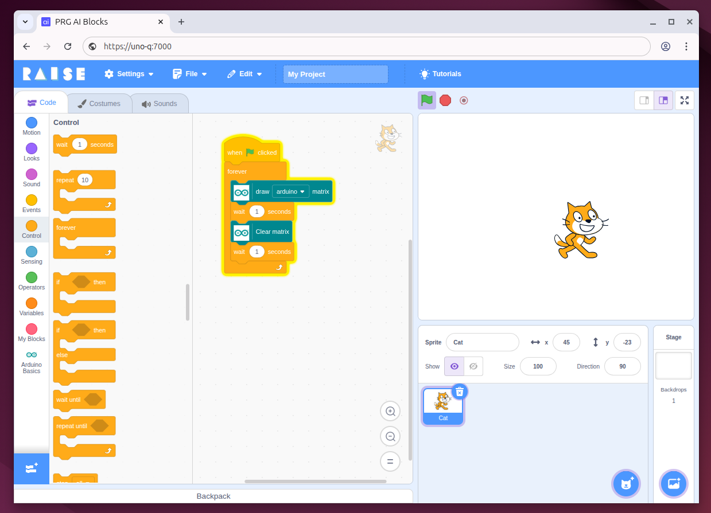

# Scratch for Arduino Uno Q

> Arduino UNO Q + Scratch = ❤️

## Description

Scratch for Arduino UNO Q is an Arduino App that runs Scratch directly on the board to control physical world (e.g., LEDs, buttons, and Arduino Modulino) with optional AI model integration.
Accessible from any device via a browser, it makes coding, electronics, and AI hands-on and easy to explore.



## Installation

- Connect the Arduino Uno Q board via USB
- Open an `adb shell` into the board using [adb](https://docs.arduino.cc/software/app-lab/tutorials/cli/)
- Copy and paste the following command into the terminal to install the latest `scratch-arduino-app` into the board:

```
curl -sSL https://raw.githubusercontent.com/dido18/scratch-arduino-app/main/install.sh | bash
```

- Open the Scratch interface at the `https://<IP_OR_BOARD_NAME>:7000` address.

NOTE: the `https` is needed by the `getUserMedia()` method for security reason.

### Local development

- `task scratch:init`
- `task scratch:local:start`
- `ŧask board:upload`
- change the `const DEFAULT_HOST =`<YOUR_IP|BOARD_NAME>`;` in the `scratch-arduino-extensions/packages/scratch-vm/src/extensions/ArduinoUnoQ.js`
- Open local scratch on http://localhost:8601/
